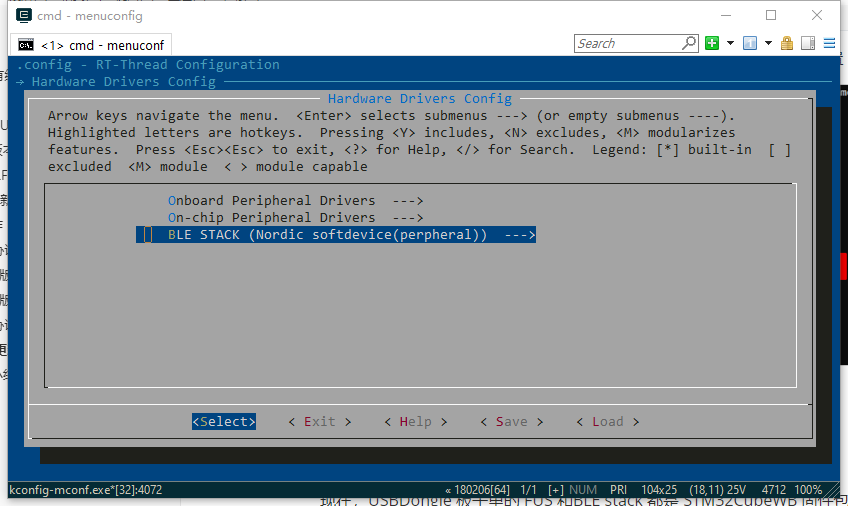
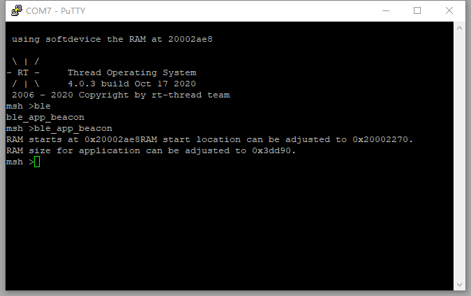
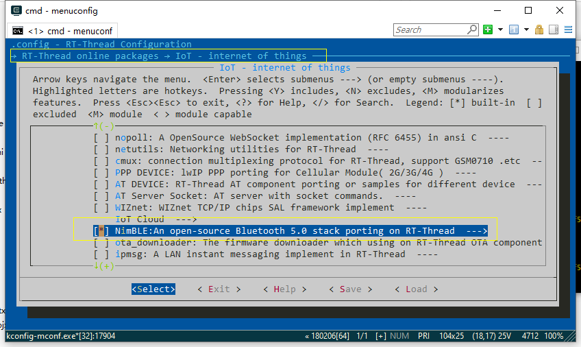
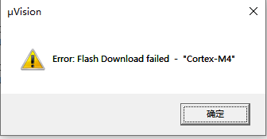
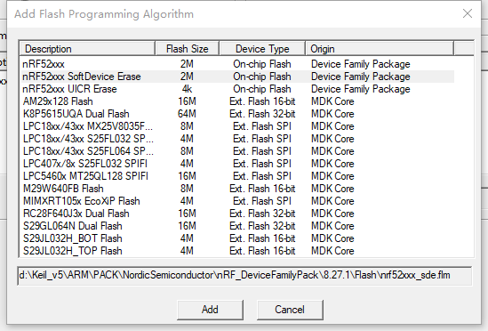

# nRF5x BSP 说明

## 简介

​         Nordic nRF5x 系列 MCU 应用广泛，且功能齐全、灵活性高，非常适用于 Bluetooth 低功耗蓝牙和 2.4 GHz 超低功耗无线应用。

​         基于官方[sdk16.0](http://developer.nordicsemi.com/nRF5_SDK/nRF5_SDK_v16.x.x/nRF5_SDK_16.0.0_98a08e2.zip)版本的基础上，该BSP将官方的SDK和RT-THREAD生态结合，让开发者可以既可以基于官方的sdk开发自己的应用，也可以使用RT-Thread生态的软件包。

​        目前支持硬件平台：`nrf52832(pca10040)`、`nrf52840`（pca10056）

​        在搭建bsp的时候，通过参考STM32的架构，预留出支持多种nordic芯片的框架，理论上可以支持更多的nordic的平台，限于目前社区小伙伴手上的开发板有限，如果您手上有相关nordic的开发板，欢迎添加对应的nordic的芯片的bsp。

Nordic nRF5x系列BSP 目前支持情况如下：

| nordic主芯片 | 开发板名称                                                   | bsp所在文件夹 | 备注 |
| ------------ | ------------------------------------------------------------ | ------------- | ---- |
| nrf52840     | 官方pca10056                                                 | nrf52840      |      |
| nrf52832     | 官方pca10040                                                 | nrf52832      |      |
| nrf52840     | [青风52840](https://item.taobao.com/item.htm?spm=a1z10.1-c-s.w4004-15118192232.5.46a15d490SURQ9&id=581711815379) | nrf52840      |      |

### 主要支持功能

- 支持官方softdevice的sample： ble_app_uart、ble_app_blinky、ble_app_hrs（softdevice是官方nordic的协议栈名称）
- 支持nimble的软件包及对应的sample
- 官方softdevice的sample和RT-THREAD驱动框架结合。

  

### 目录结构

```
nrf5x
├───docs 
│   └───images                      // nrf5x文档使用图片
│   └───nRF5x系列BSP制作教程.md
├───libraries                       // nrf5x系列支持BSP
│   └───drivers                     // nRF5x 系列设备通用驱动文件 
│   └───templates                   // 通用设备 BSP 工程模板
│   │   └───nrf52x                  // nrf52x 系列 BSP 工程模板
│   │   └───nrf5x_board_kconfig     // 通用 BSP 工程配置文件
├───nrf52832                        // nrf52832 BSP 工程
│   └───application                 // 应用代码
│   │   board                       // 链接脚本文件，开发板硬件初始化和配置文件
│   │   package                     // 软件包目录
│   │   └───nRF5_SDK                // nordic 官方 nRF5x SDK
│   │   kconfig                     // 工程配置文件
│   └───rtconfig.h
├───nrf52840                        // nrf52840 BSP 工程
└───README.md                       // nordic 工程整体介绍
```

###  如何使用

#### RT-THREAD的使用

​         默认的RT-THREAD工程是不带有蓝牙协议栈功能的，方便客户先搭建对应的bsp平台，后续可以选择任意协议栈运行蓝牙。

​        默认的BSP是支持UART和GPIO的，烧入即可亮灯。

**准备工作**

需要env环境和keil环境，并且对RT-THREAD使用稍微熟悉一些即可。

- 首先下载代码，`git clone https://github.com/RT-Thread/rt-thread.git`
- 进入到目录`rt-thread/bsp/nrf5x/nrf52840`
- 右击进入env命令行模式
- menuconfig 选择需要加载的BSP配置并且保存
- 执行`pkgs --update` 下载对应的硬件软件包（这里的HAL库采用软件包的方式，需要客户自行下载）
- 执行`scons --target=mdk5`  生成keil工程，烧入即可看到LED小灯闪烁
- 需要注意的是，如果之前板子上已经烧入softdevice的话，烧入可能会出现烧不进的情况，需要将整颗芯片擦除之后再运行rt-thread裸工程

#### Softdevice 的使用

首先可以熟悉上述工程的运行，在上述运行的基础上，我们可以试着跑一下ble_app_beacon(这个在SDK16.0中的peripheral 的sample中)

- menuconfig 进入Hardware Drivers Config， BLE STACK 选择Nordic softdevice



- menuconfig 进入peripheral libraries and drivers目录中选中nrf5x_sdk


- 进入目录选择对应的sample


- 保存配置，然后`pkgs --update`, 执行`scons --target=mdk5`  
- 打开keil 工程，softdevice的工程需要烧入官方的协议栈，所以先要烧入softdevice(如果之前已经烧入SDK16.0的softdevice，可以不用执行这一步)，点击softdevice工程，烧入即可


- 重新选择rtthread工程，进行编译，烧入，通过串口看到如下的输出即代表成功


- 这个时候我们执行命令 `ble_app_beacon` 不同的sample对应不同的命令，看到如下log代表beacon已经跑起来了



- 这个时候用nrf connect 来测试可以搜索到对应的beacon


#### nimble的使用

如果使用nimble就不能选择softdevice了，所以要清空之前的配置，为了防止误操作，可以选择将nrf52840的目录下面的内容全部执行`git reset --hard`  之后重复上述操作，然后执行`git clean -xfd`清理掉无效的文件

- menuconfig进入BLE STACK 选择nimble

- menuconfig选择nimble



- 进入Controller Configuration 选择nrf52840
- 进入Bluetooth Samples 选择ble beacon sample
- 执行`pkgs --update` 下载需要的软件包
- 执行`scons --target=mdk5` 
- 打开keil工程烧入代码，这个时候需要注意的是，如果之前有softdevice存在flash中，需要擦除芯片中的softdevice。
- 烧入之后执行cmd `ble_ibeacon`
- 之后用nrf connect 软件可以搜索到对应的beacon设备。


## FAQ:

#### 1. 如果烧入的时候出现如下状况：



说明板子上已经烧入了softdevice，需要擦除掉，才能烧入不带有softdevice的程序。

下面提供一种擦写softdevice的方法。在keil中选择softdevice Erase的FLASH算法，这个时候就烧写之前可以擦除之前的softdevice。




### 2.如果在使用softdevice的时候，连上手机时候出现一些hardfault

如下所示：

```
psr: 0x8100000f
r00: 0x00000000
r01: 0x200034e6
r02: 0x00000000
r03: 0x200034dc
r04: 0x200034dc
r05: 0x00000000
r06: 0x200034e6
r07: 0xdeadbeef
r08: 0xdeadbeef
r09: 0xdeadbeef
r10: 0xdeadbeef
r11: 0xdeadbeef
r12: 0x00000000
 lr: 0x000369af
 pc: 0x00036972
hard fault on handler

```

这个hardfault发生在SOFTDEVICE内部，由于代码不开源，这边尝试了修改如下函数，可以不触发hardfault。

```
rt_hw_interrupt_disable    PROC
    EXPORT  rt_hw_interrupt_disable
    ;MRS     r0, PRIMASK
    ;CPSID   I
    BX      LR
    ENDP

;/*
; * void rt_hw_interrupt_enable(rt_base_t level);
; */
rt_hw_interrupt_enable    PROC
    EXPORT  rt_hw_interrupt_enable
    ;MSR     PRIMASK, r0
    BX      LR
    ENDP
```


